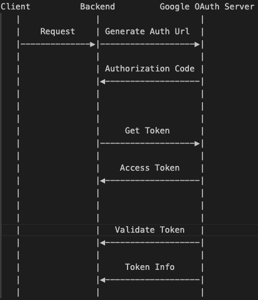
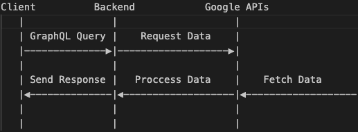

# Fastify-GraphQL-GoogleAPIs
GraphQL Federation architecture that interfaces with Google APIs. 
This backend perform authenticate using Google tokens and fetch user data from Google Calendar and Google People APIs.

## Setup Instuctions
1. Clone the repository.
2. Make sure you have Node installed on your machine.
3. Install dependencies using `npm install`.
4. Add the required environment variables to `.env` file.
5. Set up Google OAuth credentials in `configuration/credentials.ts`.
6. Start the server using `npm start` or `npm run dev` for keeping it running.

### Configuring an OAuth application in GCP
1. Create a Google Clound account here: https://cloud.google.com.
2. Create the OAuth application.
3. Enabled respective APIs and Services.
4. Create OAuth consent screen App.
5. Create Credentials and Oauth 2.0 Client.
6. Generate Access tokens.

## Sequence Diagrams:

1) Obtaining and validating the Google access token:

Description:
* Client initiating Google authentication process by accessing Backend '/' endpoint.
* After User Authentication and grant Permission, Backend calls Google OAuth Server to generate Authorization URL.
* Backend redirects to '/auth/callback' and extracts the Authorization Code from req.query.
* Backend calls Google OAuth Server with the Authorization Code to get the Access Token.
* Google OAuth Server returns the Access Token to the Backend.
* Backend verifies the token's validity before handling Client Queries.

2) Backend service interactions with Google Calendar and Google People APIs:

    
Description:
* Client GraphQL Query to the Backend '/graphql' endpoint.
* Backend sends a request to the respective Google API to fetch the data.
* Google API processes the request and fetches the required data.
* Google API sends the data back to the backend.
* Backend processes the received data.
* Backend sends the processed data as a response to the client.

## Usage Examples
1) GraphQL Request for fetching Contacts from Google People API:
curl --request POST \
  --url 'http://localhost:3000/graphql?accessToken=YOUR_ACCESS_TOKEN' \
  --header 'Content-Type: application/json' \
  --header 'User-Agent: insomnia/8.6.1' \
  --data '{"query":"{\n\tcontacts {\n\t\tname\n\t\temail\n\t\tphoneNumber\n\t}\n}"}'

2) GraphQL Request for fetching Events from Google Calendar API:
curl --request POST \
  --url 'http://localhost:3000/graphql?accessToken=YOUR_ACCESS_TOKEN' \
  --header 'Content-Type: application/json' \
  --header 'User-Agent: insomnia/8.6.1' \
  --data '{"query":"{\n\tevents {\n\t\tname\n\t\tlocation\n\t\tdescription\n\t}\n}"}'
